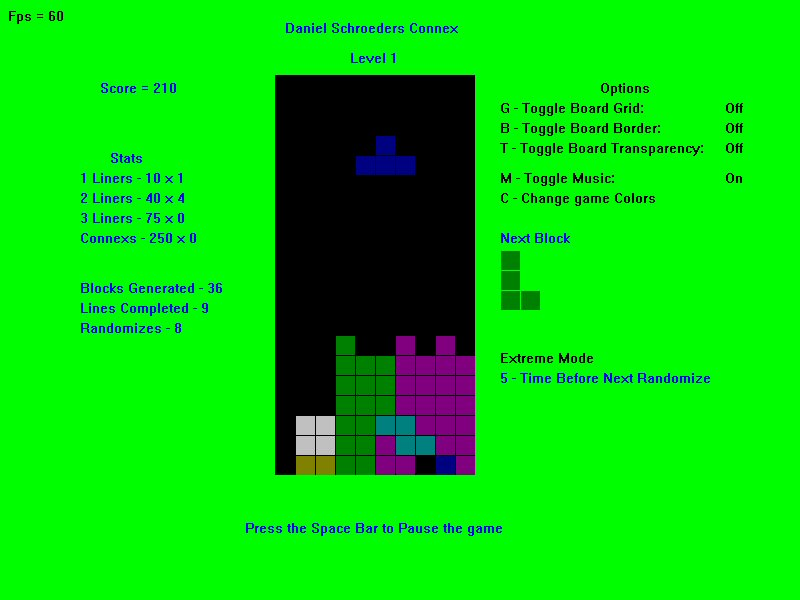

# Blasteroid

A Tetris style game created using C++ and DirectX 7.

## Get it

[Download the zip](Installers/) containing the executable and check it out.

## Requirements

You will need at least DirectX 7 installed to play the game.

## History

Connex was the very first game I ever created, back in 2003.
It's pretty much a Tetris clone with some minor additions, such as an Extreme mode where every 5 - 10 seconds the block you are placing suddenly turns into a different type of block.
I made it using C++ and DirectX 7.
I never used any external pictures of any kind; just rectangles and color so it looks sort of lame, but hey it works.
I did not code the Game Engines myself though; I used the ones from Andre LaMothe's `Tricks of the Windows Game Programming Gurus` book.
Also, all of the sounds and music for this game were from 3rd party sources as well.

I've uploaded the code and assemblies for posterity sake.
Feel free to check out [the source code](src/) 🙂
However, please don't judge me by it as it was written near the start of my programming career when I still had much to learn 😉
